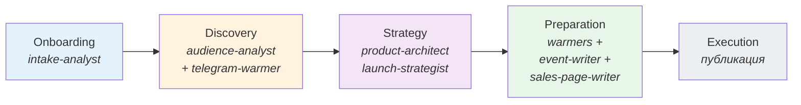
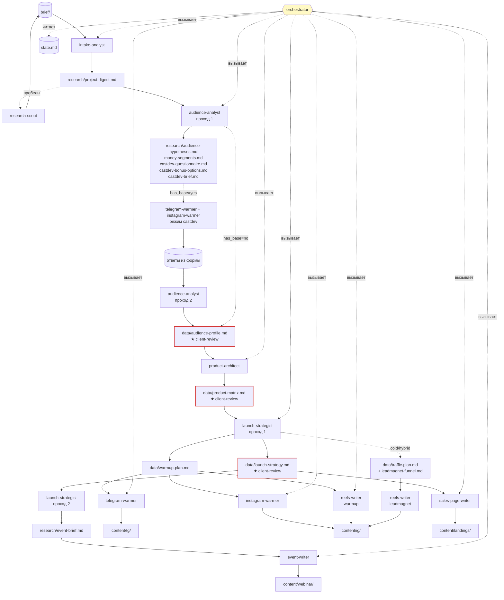
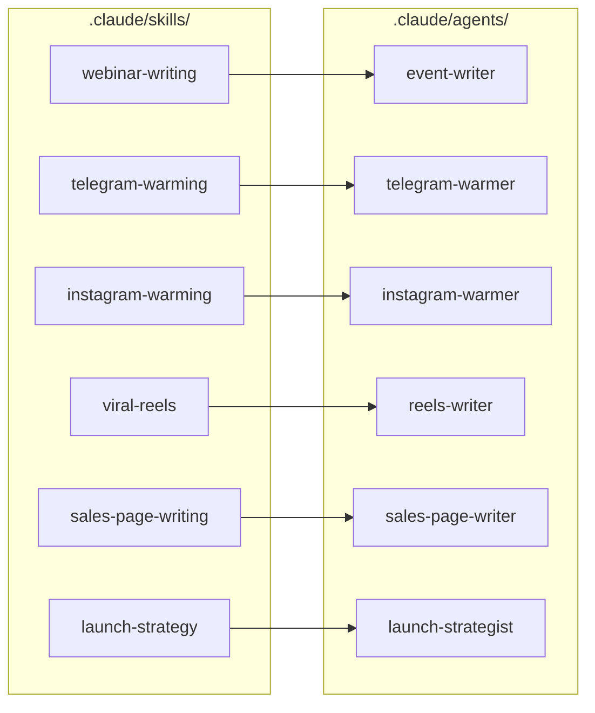

# Карта мультиагентной системы

Справочный файл. **Не грузится в контекст автоматически** — агенты его не читают, это материал для человека: онбординг в систему, объяснение клиенту, напоминание себе «кто что делает».

Если изменилась архитектура (новый агент / новая фаза / перерисовался поток артефактов) — обнови здесь вручную. Это не source of truth, это зеркало `.claude/agents/` + `_TEMPLATE/state.md`.

---

## Слой 1 — Фазы и гейты

Верхнеуровневая последовательность. Каждая фаза имеет владельца-агента и выход, после которого продюсер принимает решение о переходе.

**Правила переходов:**
- Фазы идут строго последовательно. Параллелизма между фазами нет.
- Внутри Preparation warmers и writers работают последовательно (по правилу orchestrator'а — «одна задача за раз»), даже если логически могли бы параллельно.
- Переход между фазами — только по команде продюсера. Автоматических переходов нет.

---

## Слой 2 — Поток агентов и артефактов

Детальная карта: кто что создаёт, что уходит на client-review, где ветвления по модели запуска.

**Легенда:**
- Красная обводка — артефакт обязательно идёт на `client-review` (клиент визирует).
- Жёлтый `orchestrator` — не производит контент, только диспетчирует.
- Пунктир — условные связи (срабатывают при blocked / при конкретной модели запуска).
- `(brief/)`, `(state.md)` — источники/состояния, не артефакты.

**Два прохода у агентов:**
- `audience-analyst` — проход 1 (гипотезы + касдев-ТЗ до касдева) → проход 2 (финальный профиль после ответов). **Исключение:** при `has_base = no` касдев пропускается, оба прохода идут в одном запуске — на выходе сразу `audience-profile.md` с пометкой «без верификации».
- `launch-strategist` — проход 1 (стратегия + warmup-plan) → проход 2 (event-brief после выбора формата эксперта).

**Ветвление по `has_base` (фаза Discovery):**
- `yes` — полный цикл: Проход 1 → касдев (TG + IG, mode=castdev) → Проход 2. Касдев-артефакты (`castdev-questionnaire.md`, `castdev-bonus-options.md`, `castdev-brief.md`) создаются Проходом 1.
- `no` — касдев физически невозможен (постить некуда). Проход 1 + 2 за один запуск, касдев-артефакты не создаются.

**Ветвление по `launch_model`:**
- `warm` — база есть, трафик не нужен. Активны только `warmup-plan` + TG/IG warmers.
- `cold` — базы нет. Добавляется `traffic-plan` + `leadmagnet-funnel` + `reels-writer leadmagnet` + холодный лендинг.
- `hybrid` — обе ветки параллельно.

---

## Слой 3 — Skills → Agents

Где живёт методология и какой агент её читает. Skills — это переносимые «мозги»; agents — исполнители, склеивающие skill с контекстом проекта.

**Агенты без skill-файла** (методология встроена прямо в промпт агента, отдельного skill нет):
- `intake-analyst`
- `audience-analyst`
- `product-architect`
- `research-scout`
- `orchestrator`

Если методология для одного из них разрастается — это сигнал вынести её в `.claude/skills/<topic>/`. Пример — `launch-strategist` изначально держал методологию в промпте, но после роста (~300 строк юнит-экономики + волн + форматов) её вынесли в skill `launch-strategy`.

---

## Статусы в `state.md`

Словарь, который использует `orchestrator` при обновлении фаз:

| Статус | Смысл |
|---|---|
| `pending` | не начато |
| `in-progress` | агент работает |
| `my-review` | ждёт ревью продюсера |
| `client-review` | ждёт ревью эксперта |
| `done` | завершено |
| `blocked` | заблокировано, нужен ввод |
| `skipped` | пропущено (не применимо к этому проекту) |

---

## Как обновлять эту карту

- Добавили нового агента → нарисовать его в слое 2 + (если есть skill) в слое 3.
- Изменилась структура фаз в `_TEMPLATE/state.md` → синхронизировать слой 1.
- Поменялись артефакты-выходы → обновить слой 2.
- Добавили skill → слой 3.

Если поленились обновить — никто не умрёт, но новый человек будет читать `.claude/agents/*.md` напрямую, и это медленнее.
